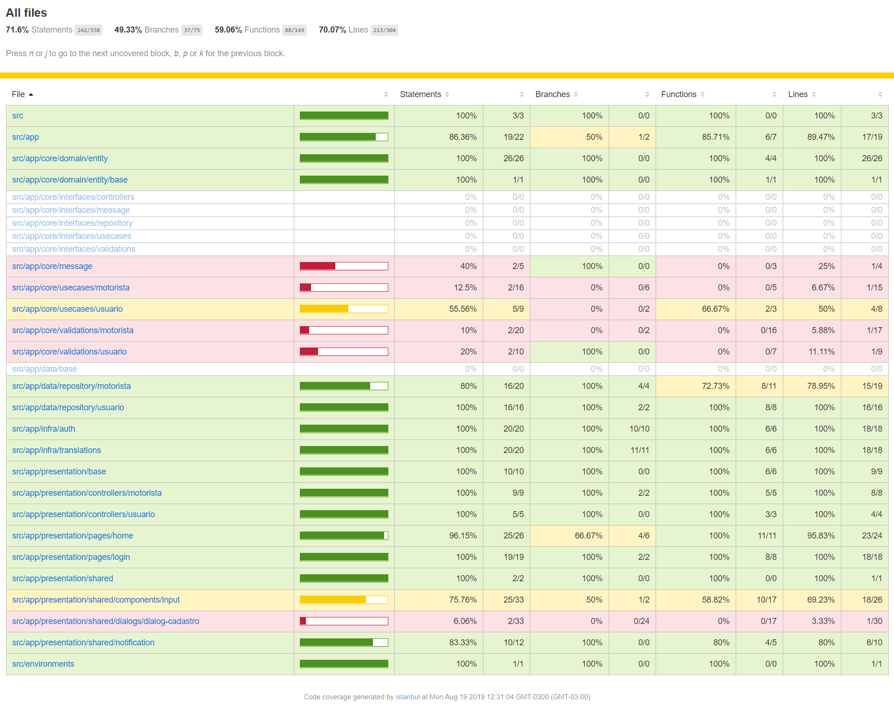
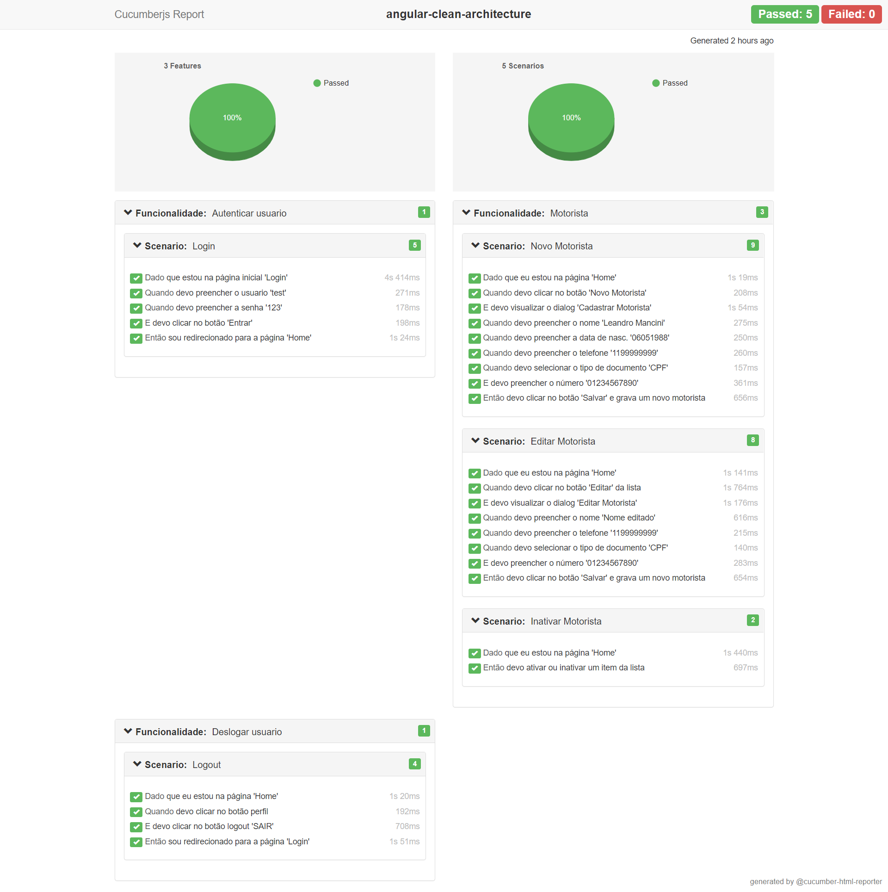

# Angular Clean Architecture

Um modelo inicial completo: exemplo de estrutura de aplicativo sob medida para escabilidade e boas praticas de desenvolvimento com Clean Code, SOLID, Clean Architecture e Orientação a Objetose código para cada coisa comum necessária em projetos corporativos, como testes de unidade, roteamento, autenticação, extensões de serviço HTTPS, suporte a i18n com alteração dinâmica de idioma e detecção automática de idioma do usuário

## Começando

Baixe o repositório:

```bash
git clone https://github.com/leandro-mancini/angular-clean-architecture.git
```

Dados de autenticação do usuário:

***Usuário***: test
<br>
***Password*** 123

### Angular aplicativo web

1. Instale as dependências:

```bash
npm install
```

2. Inicie o servidor de desenvolvimento e abra localhost:4200 em seu navegador:

```bash
npm start
```

3. Instalar o JSON Server:

```bash
npm install -g json-server
```

4. Abra um novo terminal e inicie o servidor JSON:

```bash
npm run server
```

### Estrutura do projeto

````
| - app
| | - core
| | | - domain
| | | | - [+] entity
| | | - interfaces
| | | | - [+] controllers
| | | | - [+] entity
| | | | - [+] message
| | | | - [+] repository
| | | | - [+] usecases
| | | | - [+] validations
| | | - [+] message
| | | - [+] usecases
| | | - core.module.ts
| | - data
| | | - [+] repository
| | | - data.module.ts
| | - infra
| | | - [+] auth
| | | - [+] http
| | | - [+] translations
| | | - infra.module.ts
| | - presentation
| | | - [+] base
| | | - [+] controllers
| | | - [+] pages
| | | - [+] shared
| | | - presentation.module.ts
````

### Principais tarefas

A automação de tarefas é baseada em scripts do [NPM scripts](https://docs.npmjs.com/misc/scripts).

Tarefas                       | Descrição
----------------------------- |---------------------------------------------------------------------------------------
npm start                     | Execute o servidor de desenvolvimento em `http://localhost:4200/`
npm run test                  | Execute testes unitários via [Karma](https://karma-runner.github.io) no modo de observação
npm run e2e                   | Executar testes e2e usando [Protractor](http://www.protractortest.org)
npm run lint                  | Código Lint
npm run server                | Executar servidor de desenvolvimento APIs
npm run translations:extract  | Extrair strings do código e modelos para `src/assets/i18n/template.json`

### O que esta no pacote

O modelo do aplicativo é baseado em [HTML5](http://whatwg.org/html), [TypeScript](http://www.typescriptlang.org) e [Sass](http://sass-lang.com). 
Os arquivos de tradução usam o formato [JSON](http://www.json.org) comum .

### Ferramentas

Os processos de desenvolvimento, construção e qualidade são baseados em scripts [angular-cli](https://github.com/angular/angular-cli) e [NPM scripts](https://docs.npmjs.com/misc/scripts), que incluem:

- Processo otimizado de compilação e empacotamento com o [Webpack](https://webpack.github.io)
- CSS entre navegadores com [autoprefixer](https://github.com/postcss/autoprefixer) e [browserslist](https://github.com/ai/browserslist)
- Testes de unidade usando [Jasmine](http://jasmine.github.io) e [Karma](https://karma-runner.github.io)
- Testes de ponta a ponta usando [Protractor](https://github.com/angular/protractor)
- Análise de código estático: [TSLint](https://github.com/palantir/tslint), [Codelyzer](https://github.com/mgechev/codelyzer), [Stylelint](http://stylelint.io) e [HTMLHint](http://htmlhint.com/)

### Bibliotecas

- [Angular](https://angular.io)
- [Material Angular](https://material.angular.io)
- [Bootstrap 4](https://getbootstrap.com)
- [RxJS](http://reactivex.io/rxjs)
- [ngx-translate](https://github.com/ngx-translate/core)
- [Lodash](https://lodash.com)
- [Moment](https://momentjs.com)
- [AutoMapper](https://github.com/loedeman/AutoMapper)
- [Fluent validator](https://github.com/VeritasSoftware/ts.validator)
- [Jasmine](https://jasmine.github.io)
- [chai](https://www.chaijs.com)
- [Cucumber](https://cucumber.io)
- [Storybook](https://storybook.js.org)

## Executando teste de unidade

1. Abra um novo terminal e inicie o servidor JSON:

```bash
npm run server
```

2. Inicie o servidor de test:

```bash
npm run test
```

3. Vá para a pasta do projeto web `./coverage`.

4. Execute o arquivo `index.html` para poder visualizar o code covarage:

<br>



## Executando teste end-to-end

1. Abra um novo terminal e inicie o servidor JSON:

```bash
npm run server
```

2. Inicie o servidor de test:

```bash
npm run e2e
```

3. Após ter executado todo o teste vá para a pasta do projeto web `./e2e/reports/html`.

4. Execute o arquivo `cucumber_reporter.html` para poder visualizar um dashboard do cucumber dos steps de cada teste.


